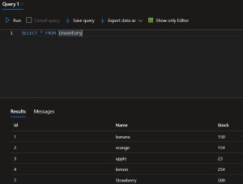

## Base de datos en Azure  (DB)

Proporciona servicos de bases de datos para una amplia variedad de tipos y volumenes de datos

### AZURE SQL Databse

**Todas las bases de datos son PaaS** (por que ya esta instalada en un sistema operativo)

- **Modelo de servicio:** PaaS
- **Que es:** Base de datos estructurada y relacional
- **Caracteristicas:** Ejecuta la ultima version estable de microsoft SQL server
- **Cuando usar:** Se usa para migra datos
- **Caracteristica:** Se usa Azure Database Migration Service
- **Cuando usar:** se usa cuando sabemos exactamente que vamos a registrar

-----------------------------------------------------------------------------------------------

### Pasos para crear un SQL Database

1.- Copiamos el link del repositorio en el bash de azure.

2.- Agregamos los comando **cd dp-900/sql**.

3.- Agregamos el comando **bash setup.sh** y esperemos que la cree.

4.- Te crea la base de datos en uno de tus grupos de recursos, de forma aleatoria.

5.- Agregamos el farewell de seguridad y le añadimos nuestra direccion IPv4.

 

6.-Ingresamos el usuario y la contraseña.

7.- Una ves dentro podemos editar consultas o consultarlas.

8.-Para consultar debo poner el comando **Select * FROM (significa todo el asterisco) y noos mostrara los resultados**.

9.- Si queremos buscar en que carpetas busco ese comando, debemos darle a la flechita en tables para ver en que tablas lo busco.

10.- Si queremos agregar un dato, debemos poner el comando **INSERT INTO** Inventory **(nombre de la tabla)** **(Id, Inventory.Name, Stock)** **values(8, 'Strawberry', 500);**.

11.- Podemos selecionar las consultas mediante el comando **SELECT * FROM Inventory** y asi vemos lo que acabamos de editar.

------------------------------------------------------------------------------------------------------------------------------
